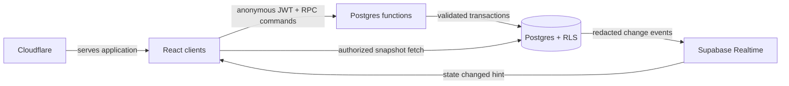
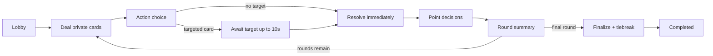

# ScoreUp

**Draw wisely. Challenge boldly. Score your way to the top.**

ScoreUp is a mobile-first, real-time multiplayer party game for 2–10 players. Hidden point cards create tension, action cards disrupt the leaderboard, and each player holds one skill-based Mini-Game Challenge that can turn a match at exactly the right moment.

> Project status: **Milestone 4 Action Cards is implemented.** ScoreUp now includes the complete server-authoritative 18-card Mystery Action system. Mini-Game Challenges remain reserved for Milestone 5.

## Screenshots

Screenshots and hosted preview links will be added during the final deployment milestone.

## Milestone 4 features

- Restored-or-created anonymous Supabase browser sessions with explicit unconfigured, loading, failure, and retry states
- Atomic, idempotent room creation and serialized room joining through authenticated Postgres RPCs
- 2–10 player capacity, case-insensitive active-name uniqueness, five-character collision-retried codes, and optional bcrypt-compatible password hashes
- Authoritative lobby snapshots with ready state, live connection state, host controls, copyable links/codes, leave/remove actions, and server-enforced start eligibility
- Private room-scoped Realtime broadcasts used only as invalidation hints; clients refetch authorized snapshots after every hint
- Heartbeat-based connection recovery and activity-triggered host transfer after a 60-second grace period
- RLS isolation, column-level grants, authenticated command-only writes, and multi-identity pgTAP coverage
- Shared typed validation contracts plus Vitest and React Testing Library coverage for auth, services, validation, Realtime cleanup, and forms
- Atomic roster freeze, match initialization, secure server-side card dealing, and per-round randomized decision order
- Transactional, idempotent Lock In, point-card challenge, timeout, and summary-advance commands
- Private-card RLS isolation, actor-specific reconnection snapshots, append-only score awards, and redacted public events
- Server-timed turns and summaries with activity-triggered overdue processing
- Responsive core-game UI with private card, countdown, challenge targeting, leaderboard, public feed, round summaries, and tied-first completion
- Shared action-choice phase with automatic skips, per-match allowances, target sub-state, and server deadlines
- Weighted private 18-card catalog with immediate transactional score/card effects, shields, and mutation audit history
- Signed action score-ledger entries, owner-only card results, public-safe events, and idempotent Draw/Skip/target RPCs
- Accessible responsive card reveal, target selection, pending-player progress, shield status, reconnect recovery, and reduced-motion support

## Game rules

Every round, each player receives a private point card. On their turn, they either **Lock In** its value or **Challenge** an unresolved opponent. The higher card earns both values; equal cards each keep their own value. Players may also draw a limited number of immediate Mystery Action Cards and use one Mini-Game Challenge token per match. The highest final score wins.

ScoreUp uses points only. It contains no real-money mechanics, purchases, currency, or prizes.

## Technology

- React 19 and strict TypeScript
- Vite 8 with a Cloudflare-compatible Vinext route layer
- Tailwind CSS 4 and a token-driven responsive design system
- Supabase Postgres, Realtime, anonymous authentication, and narrowly scoped RPCs
- Vitest, React Testing Library, and Playwright (Playwright multiplayer journeys begin with live rooms)
- Cloudflare deployment output

## Architecture



The browser is a command requester and renderer, never a game authority. Postgres RPCs own room and game transactions, including action-card selection and resolution. The browser never submits a card code, probability, score, point-card value, effect parameter, random outcome, or actor identity. Realtime messages are invalidation hints; reconnecting clients always fetch an authoritative actor-specific snapshot.

The full [engineering blueprint](docs/product-engineering-plan.md), [database design](docs/database-schema.md), and [security model](docs/security-model.md) document the planned implementation.

## State machine



Every implemented transition is a versioned, idempotent server command with phase, actor, deadline, and eligibility validation. The action phase cannot close while a persisted draw awaits a target.

## Database design

Milestone 4 adds normalized action choices/draws, a private weighted catalog, temporary shields, point-card mutation receipts, action references in the signed score ledger, and actor-private action snapshots. See [docs/database-schema.md](docs/database-schema.md), [Core Game decisions](docs/milestone-3.md), and [Action Card decisions](docs/milestone-4.md).

## Security approach

- Anonymous Supabase identity binds a device session to one room player
- Row Level Security isolates rooms and hidden card rows
- Score-changing tables deny direct browser writes
- RPCs derive the actor from `auth.uid()` and require an anonymous JWT
- Cryptographically secure server randomness selects cards, seeds, and targets
- Row/advisory locking and request identifiers prevent duplicate room operations
- Room codes locate rooms but never grant control of an existing player
- Passwords are slow-hashed and server-only; service-role credentials never reach Vite
- Replays, duplicate actions, stale phases, and impossible mini-game results are rejected

## Realtime strategy

Realtime carries only private `{ changed: true }` invalidation hints on room-scoped lobby and game channels. It never carries private card values, password material, or auth identifiers. Authorized clients refetch actor-specific snapshots, so dropped or coalesced messages cannot make an event stream authoritative.

## Local setup

Prerequisites: Node.js 22.13 or newer and a healthy Docker Desktop daemon.

```bash
npm install
cp .env.example .env.local
npm run db:start
npm run db:reset
npm run test:db
npm run dev
```

After `npm run db:start`, run `npx supabase status` and copy the local API URL and publishable/anon key into `.env.local` as `VITE_SUPABASE_URL` and `VITE_SUPABASE_PUBLISHABLE_KEY`. Never use a service-role key in a Vite variable.

For a hosted project: enable anonymous sign-ins in Supabase Auth; link the CLI with `npx supabase login` and `npx supabase link --project-ref <project-ref>`; apply the migration with `npx supabase db push`; use the hosted project URL and publishable key in the frontend environment; and require private Realtime channels (disable public channel access). See [Milestone 2 operations](docs/milestone-2.md) for the full setup and recovery notes.

## Testing

```bash
npm run typecheck
npm run lint
npm test
npm run db:lint
npm run test:db
npm run format:check
npm run build
```

The TypeScript suite covers configuration, session restoration, strict lobby/game/action contracts, redacted commands, RPC error mapping, Realtime cleanup, and forms. pgTAP exercises multiple identities against real RLS/RPC boundaries, all 18 action effects, weighted catalog totals, targeted resolution, shield consumption, rounding, allowances, automatic skips, replay safety, privacy, Core Game rules, and reconnection.

## Deployment

The production application is designed for Cloudflare deployment with Supabase as its only game backend. The final deployment milestone will document project creation, migrations, Edge Function deployment, allowed origins, SPA routing, environment settings, monitoring, and smoke tests. No real credentials belong in source control.

## Portfolio engineering highlights

- Real-time multiplayer synchronization
- Server-authoritative state machine
- Hidden-information security with PostgreSQL RLS
- Transactional point transfers and append-only score ledger
- Idempotent commands and replay protection
- Reconnection with snapshot recovery
- Seeded, bandwidth-efficient mini-games
- Accessible mobile game-interface design

## Future improvements

Custom card packs, spectator mode, private tournaments, replay timelines, additional accessible mini-games, moderation tools, and telemetry-driven deck balancing are natural extensions after the core game is proven.
