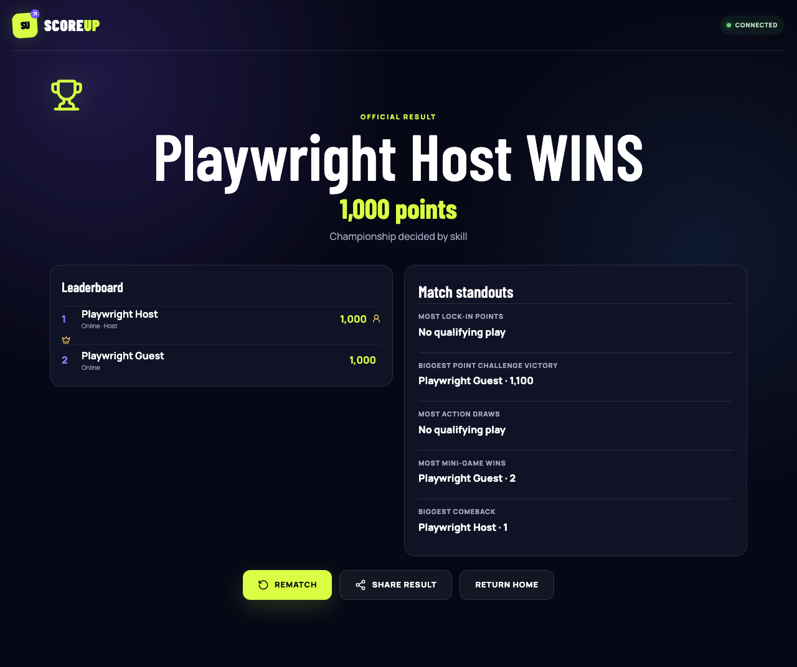
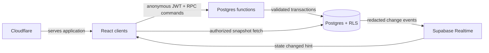
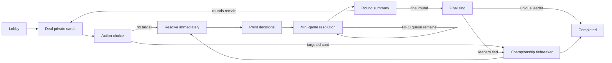

# ScoreUp

**Draw wisely. Challenge boldly. Score your way to the top.**

ScoreUp is a mobile-first, real-time multiplayer party game for 2–10 players. Hidden point cards create tension, action cards disrupt the leaderboard, and each player holds one skill-based Mini-Game Challenge that can turn a match at exactly the right moment.

> Project status: **Milestone 7 production release is in progress.** Milestones 1–6 are committed and locally verified. Production configuration, CI, deployment, hosted migrations, and live smoke testing must all pass before ScoreUp is declared production-ready.

[GitHub repository](https://github.com/japjotsingh18/ScoreUp) · Live demo will be linked after the verified production deployment.

## Screenshots

The final-results screen below was captured by the real local two-client Playwright completion journey; it is not a mockup.



## Implemented features through Milestone 6

- Restored-or-created anonymous Supabase browser sessions with explicit unconfigured, loading, failure, and retry states
- Atomic, idempotent room creation and serialized room joining through authenticated Postgres RPCs
- 2–10 player capacity, case-insensitive active-name uniqueness, five-character collision-retried codes, and optional bcrypt-compatible password hashes
- Authoritative lobby snapshots with ready state, live connection state, host controls, copyable links/codes, leave/remove actions, and server-enforced start eligibility
- Private room-scoped Realtime broadcasts used only as invalidation hints; clients refetch authorized snapshots after every hint
- Heartbeat-based connection recovery and activity-triggered host transfer after a 60-second grace period
- RLS isolation, column-level grants, authenticated command-only writes, and multi-identity pgTAP coverage
- Shared typed validation contracts plus Vitest and React Testing Library coverage for auth, services, validation, Realtime cleanup, and forms
- Atomic roster freeze, match initialization, secure server-side card dealing, and per-round randomized decision order
- Transactional, idempotent Lock In, point-card challenge, timeout, and summary-advance commands
- Private-card RLS isolation, actor-specific reconnection snapshots, append-only score awards, and redacted public events
- Server-timed turns and summaries with activity-triggered overdue processing
- Responsive core-game UI with private card, countdown, challenge targeting, leaderboard, public feed, round summaries, and tied-first completion
- Shared action-choice phase with automatic skips, per-match allowances, target sub-state, and server deadlines
- Weighted private 18-card catalog with immediate transactional score/card effects, shields, and mutation audit history
- Signed action score-ledger entries, owner-only card results, public-safe events, and idempotent Draw/Skip/target RPCs
- Accessible responsive card reveal, target selection, pending-player progress, shield status, reconnect recovery, and reduced-motion support
- One Mini-Game Challenge token per player and match, with requests queued during point decisions and tokens consumed only at successful start
- FIFO room queue, per-participant conflict locks, one active challenge per room, live-score revalidation, and automatic queue advancement before round summary
- Transactional Half/All matched-stake escrow, signed deduction/award/refund ledger entries, non-negative balances, and idempotent settlement
- Secure server-selected Stop the Bar, Memory Sequence, and Find the Different Symbol specifications with synchronized starts and compact validated submissions
- Ordinary-tie Stop the Bar, repeated-tie secure random fallback, database-time timeouts, private participant snapshots, and reconnect-safe UI
- Idempotent `finalizing` → championship-or-completed flow with immutable final results, competition ranking, and preserved tied scores
- Shared server-seeded championship Stop the Bar for tied leaders, with skill, timing, secure-fallback, and timeout outcomes that alter rank only
- Reproducible server-side Lock In, point challenge, Action draw, Mini-Game win, and comeback awards with ties and zero-qualifier handling
- New-identity rematch lobbies that retain room settings and roster while isolating old commands, submissions, events, and match history
- Responsive final celebration, final leaderboard, public-safe result sharing, Return Home cleanup, sound controls, and persistent reduced-motion controls
- Playwright Chromium coverage with two isolated anonymous sessions, local-only provisioning, axe serious/critical checks, reconnect, timeout, rematch, and unauthorized-view assertions

## Game rules

Every round, each player receives a private point card. On their turn, they either **Lock In** its value or **Challenge** an unresolved opponent. The higher card earns both values; equal cards each keep their own value. Players may also draw a limited number of immediate Mystery Action Cards and use one Mini-Game Challenge token per match. The highest final score wins.

ScoreUp uses points only. It contains no real-money mechanics, purchases, currency, or prizes.

## Technology

- React 19 and strict TypeScript
- Vite 8 with a Cloudflare-compatible Vinext route layer
- Tailwind CSS 4 and a token-driven responsive design system
- Supabase Postgres, Realtime, anonymous authentication, and narrowly scoped RPCs
- Vitest, React Testing Library, and pgTAP database integration tests
- Cloudflare Sites deployment with a Vinext Worker and immutable static assets

## Architecture



The browser is a command requester and renderer, never a game authority. Postgres RPCs own room and game transactions, including action-card selection, Mini-Game queueing, escrow, validation, and resolution. The browser never submits an authoritative score, stake, pot, seed, target, winner, adjusted result, random outcome, or actor identity. Realtime messages are invalidation hints; reconnecting clients always fetch an authoritative actor-specific snapshot.

The full [production architecture](docs/architecture.md), [engineering blueprint](docs/product-engineering-plan.md), [database design](docs/database-schema.md), and [security model](docs/security-model.md) document the implementation and trust boundaries.

## State machine



Every implemented transition is a versioned, idempotent server command with phase, actor, deadline, and eligibility validation. The action phase cannot close while a persisted draw awaits a target.

## Database design

Milestone 6 adds championship attempts/submissions, immutable match results/rankings/awards, and rematch lineage. See [docs/database-schema.md](docs/database-schema.md), [Mini-Game decisions](docs/milestone-5.md), and [completion decisions](docs/milestone-6.md).

## Security approach

- Anonymous Supabase identity binds a device session to one room player
- Row Level Security isolates rooms and hidden card rows
- Score-changing tables deny direct browser writes
- RPCs derive the actor from `auth.uid()` and require an anonymous JWT
- Cryptographically secure server randomness selects cards, seeds, and targets
- Row/advisory locking and request identifiers prevent duplicate room operations
- Room codes locate rooms but never grant control of an existing player
- Passwords are slow-hashed and server-only; service-role credentials never reach Vite
- Replays, duplicate actions, stale phases, and impossible mini-game results are rejected
- Final ranks/statistics are write-protected, raw championship seeds stay private, and rematches cannot reuse old room-scoped commands

## Realtime strategy

Realtime carries only private `{ changed: true }` invalidation hints on room-scoped lobby and game channels. It never carries private card values, password material, auth identifiers, results, or seeds. Authorized clients refetch actor-specific snapshots, so dropped or coalesced messages cannot make an event stream authoritative. Heartbeat-only timestamp writes are deliberately suppressed from game broadcasts to prevent a cross-client refetch loop; visible connection changes still broadcast.

## Local setup

Prerequisites: Node.js 22.13 or newer and a healthy Docker Desktop daemon.

```bash
npm install
cp .env.example .env.local
npm run db:start
npm run db:reset
npm run test:db
npx playwright install chromium
npm run dev
```

After `npm run db:start`, run `npx supabase status` and copy the local API URL and publishable/anon key into `.env.local` as `VITE_SUPABASE_URL` and `VITE_SUPABASE_PUBLISHABLE_KEY`. Never use a service-role key in a Vite variable.

For a hosted project: enable anonymous sign-ins in Supabase Auth; link the CLI with `npx supabase login` and `npx supabase link --project-ref <project-ref>`; apply the migration with `npx supabase db push`; use the hosted project URL and publishable key in the frontend environment; and require private Realtime channels (disable public channel access). See [Milestone 2 operations](docs/milestone-2.md) for the full setup and recovery notes.

## Testing

```bash
npm run typecheck
npm run lint
npm test
npm run test:e2e
npm run db:lint
npm run test:db
npm run format:check
npm run build
```

The TypeScript suite covers configuration, session restoration, strict lobby/game/completion contracts, compact commands, preferences, accessible challenge/final UI, RPC error mapping, Realtime cleanup, security-header construction, and forms. pgTAP exercises multiple identities against real RLS/RPC boundaries, finalization, ranking, statistics, championship outcomes, rematch isolation, queue/escrow rules, privacy, and replay safety. Playwright runs real Chromium against local Supabase with two isolated anonymous contexts; its provisioning helper refuses non-loopback application origins and keeps all database-owner access outside browser code.

`npm audit --omit=dev` is clean after the non-major Next.js 16.3.1 toolchain update, which also resolves the affected transitive Nano ID, PostCSS, and Sharp versions. No forced audit remediation was used.

## Production deployment

Vinext emits a Worker/RSC entry point plus static client assets, so ScoreUp deploys through the repository's Cloudflare-backed Sites configuration rather than a static-only Pages directory. The Worker applies security headers to dynamic responses; `_headers` applies the matching policy to static assets. Hashed assets are cached immutably, while HTML and RSC responses are not cached.

Production requires a dedicated Supabase project with anonymous sign-ins enabled, private Realtime channels, the exact Cloudflare HTTPS origin in Auth settings, and all checked-in migrations applied in order. Do not run the local seed, pgTAP fixtures, provisioning helpers, or any reset command against production.

Public browser environment variables:

| Variable                        | Purpose                                      |
| ------------------------------- | -------------------------------------------- |
| `VITE_SUPABASE_URL`             | Production Supabase HTTPS API origin         |
| `VITE_SUPABASE_PUBLISHABLE_KEY` | Public browser key protected by RLS and RPCs |

Never expose the service-role/secret key, database password, Supabase access token, or Cloudflare credential to browser code. Vite variables are public by design.

See the [production runbook](docs/operations.md) for release, migration, rollback, monitoring, backup, credential-rotation, incident-response, and safe-disable procedures. The [Milestone 7 record](docs/milestone-7.md) explains the deployment architecture decision.

## Accessibility

ScoreUp uses semantic landmarks and headings, keyboard-operable actions and Mini-Games, labeled controls, non-color status text, live error/status regions, persistent reduced-motion preferences, mobile touch targets, and automated axe checks for serious/critical findings. Automated coverage is a release guard, not a claim of complete WCAG conformance.

## Known limitations

- Host transfer, stale-seat cleanup, and game deadlines are activity-triggered rather than scheduler-driven.
- Browser-measured Mini-Game and championship timing is bounded and server-validated but is not tournament-grade device attestation.
- Anonymous players can lose their seat identity if they clear the stored browser session.
- Native Web Share is not enabled; final results use public-safe clipboard text with a manual-copy fallback.
- The Free Supabase plan can pause after inactivity and requires regular logical exports for stronger recovery expectations.

## Portfolio engineering highlights

- Real-time multiplayer synchronization
- Server-authoritative state machine
- Hidden-information security with PostgreSQL RLS
- Transactional point transfers and append-only score ledger
- Idempotent commands and replay protection
- Reconnection with snapshot recovery
- Seeded, bandwidth-efficient mini-games
- Accessible mobile game-interface design

## Future improvements

Custom card packs, spectator mode, private tournaments, replay timelines, additional accessible mini-games, moderation tools, and telemetry-driven deck balancing are natural extensions after the core game is proven.
