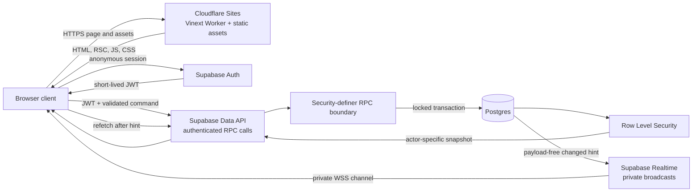
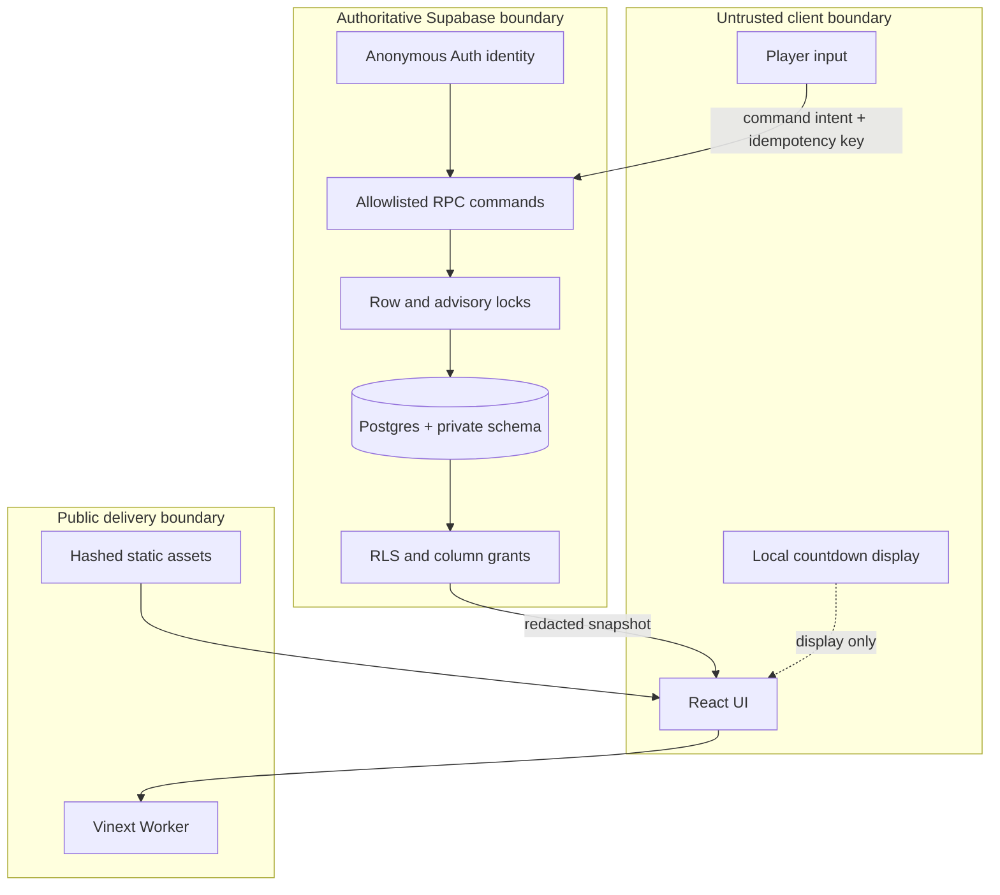
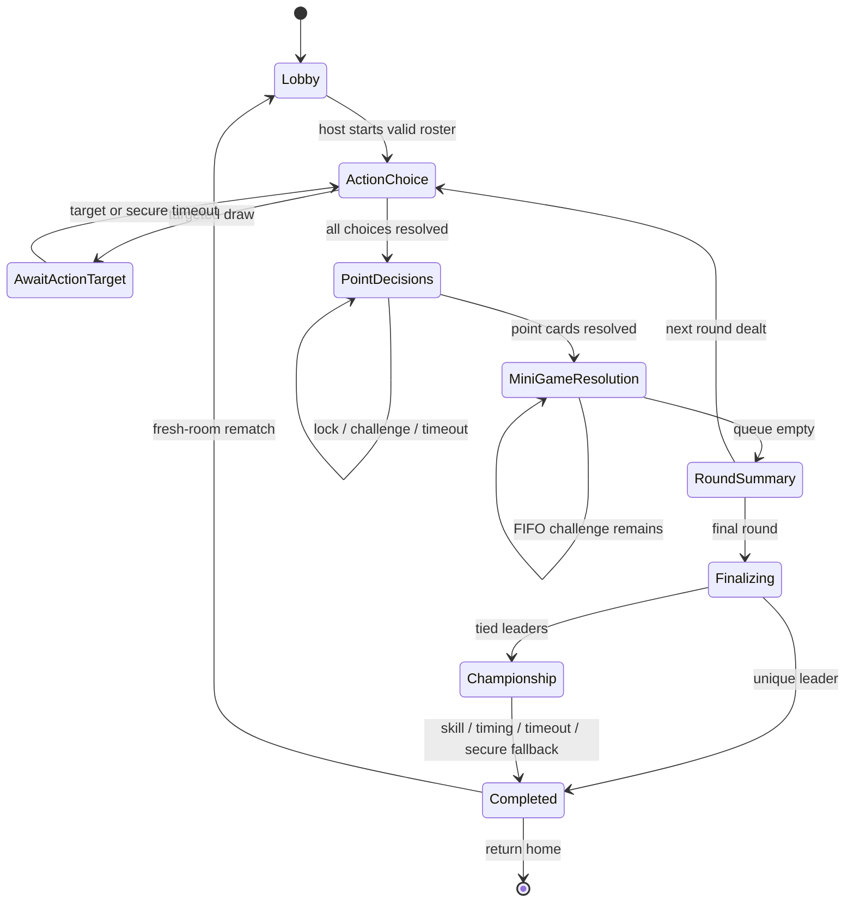

# Production architecture

ScoreUp is a browser-driven interface over a server-authoritative Postgres game engine. Cloudflare serves the Vinext application shell, while the browser talks directly to Supabase with an anonymous-user JWT and a public publishable key. No trusted game transition executes in the browser or Cloudflare application shell.

## Runtime topology

Cloudflare Pages-style direct static upload is not the deployment unit for this repository. Vinext emits `dist/server/index.js` plus `dist/client`, so the supported Sites deployment packages a Worker entry point and static asset binding together. This preserves App Router/RSC behavior without changing frameworks.

## Trust boundary

The client may request Draw, Skip, Lock In, Challenge, Mini-Game submission, finalization processing, or rematch. The database derives the actor from `auth.uid()` and determines phase, eligibility, target, timing, random result, score delta, winner, rank, and next state. Client-supplied authoritative values are rejected or not accepted by the RPC signature.

## State machine

Every persisted transition is transactional and idempotent. Activity-triggered processors advance expired turns, queued challenges, finalization, and host transfer; Realtime delivery is never required for correctness.

## Hidden information and Realtime

- RLS exposes an unresolved point card only to its owner.
- Action-card identity and private resolution are owner-only until a public-safe event is emitted.
- Mini-Game specifications are participant-only; raw seeds and expected answers stay in `private`.
- Championship submissions are caller-only and raw championship seeds remain private.
- Realtime sends only `{ changed: true }` on private room channels.
- A notification triggers an authorized snapshot fetch. Missed, duplicated, or reordered notifications cannot become game state.

## Transactional scoring

`score_ledger` is append-only and accepts exactly one supported source per row. Unique source keys make Lock In awards, challenge awards, Action effects, Mini-Game escrow, settlement, and refunds replay-safe. Balances are changed under locks, may not become negative, and are never submitted by a browser.

## Production delivery and headers

Content-hashed assets are cached immutably. HTML and RSC responses are marked `private, no-store`. The Worker adds CSP, HSTS on HTTPS, `Referrer-Policy`, `Permissions-Policy`, frame denial, and MIME-sniffing protection. CSP `connect-src` permits only the application origin and the configured Supabase HTTPS/WSS origin. Vinext currently requires inline RSC bootstrap scripts and embedded font CSS, so the policy documents narrowly scoped `'unsafe-inline'` allowances without permitting third-party script or style origins.

See [database design](database-schema.md), [security model](security-model.md), and [operations](operations.md) for implementation and recovery details.
