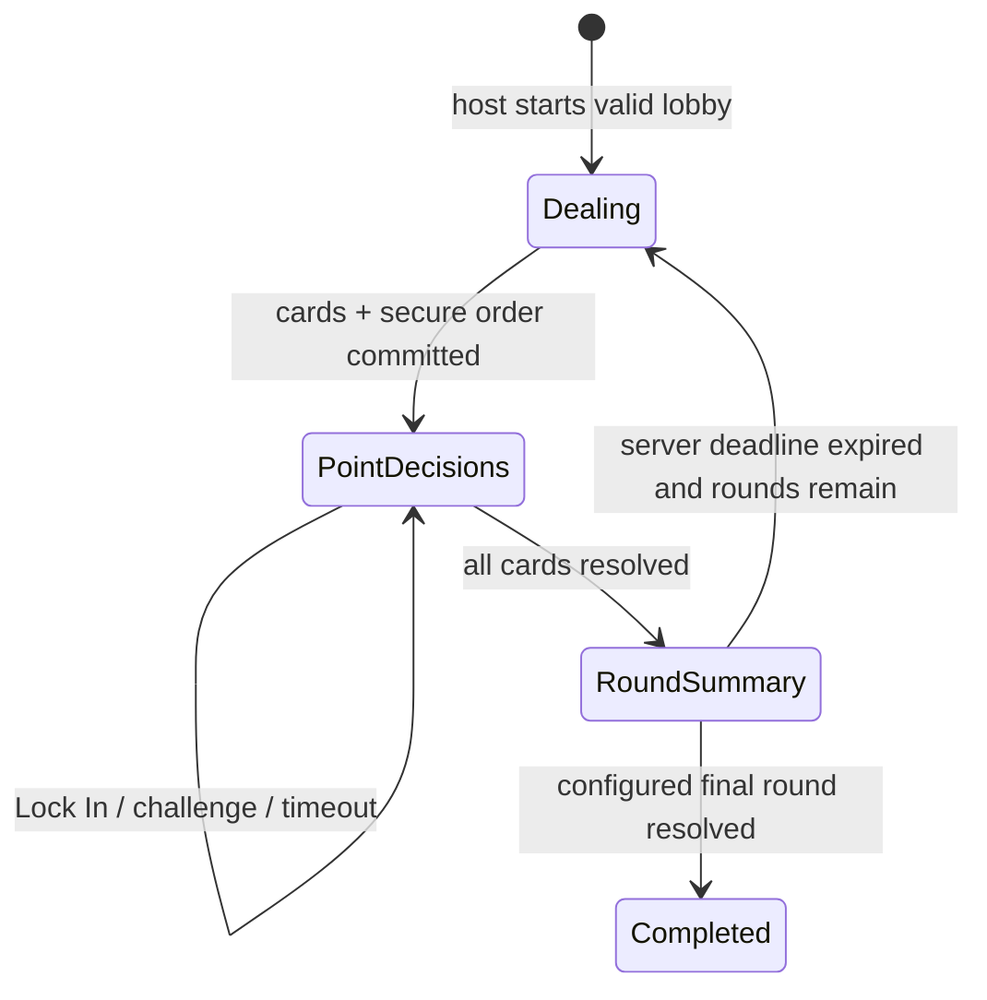

# Milestone 3: Core Game

Milestone 3 implements the complete server-authoritative point-card loop. It does not implement mystery Action Card effects, Mini-Game Challenges, final tiebreaker gameplay, rematches, or full post-match statistics.

## State machine and invariants



- The host start transaction freezes only connected, active lobby seats and prevents later joins.
- The database generates cards and turn order. The browser never sends values, scores, phases, deadlines, or winners.
- Only the current unresolved actor may Lock In or challenge before the server deadline.
- A challenge target must be another unresolved participant in the same match and round.
- One acting decision exists per player/round; ledger/source constraints prevent duplicate awards.
- Resolved players are skipped. When one unresolved player remains, the database automatically locks that card in.
- Completed non-final rounds enter an eight-second summary. Any participant may request authoritative advancement after it expires.
- Final first-place ties set `tiebreaker_required`; no unique winner is declared.

## Reconnection and Realtime

The anonymous Supabase session restores the player through `auth.uid()`. `get_match_snapshot` returns current public state, the caller's private card, eligible targets, completed summaries, recent safe events, and server time. It never depends on missed Realtime events and never creates a new player/card.

Private `room:<uuid>:game` broadcasts contain only `{ changed: true }`. Clients refetch after notification. Countdown display is derived locally from the shared server deadline; the database determines whether that deadline is actually expired.

## Deadline limitation

Timeout and summary processing is activity-triggered. An authorized participant requests processing when its countdown reaches zero. Concurrent/replayed calls serialize on authoritative state and remain idempotent. A completely idle room needs a returning participant or a future scheduled worker before overdue state advances.

## Point-card deck

The server-side weighted deck contains `0, 100, 250, 500, 750, 1000`, each initially with weight four. Weighting creates scalable duplicates so clients cannot infer every opponent card. Original/current values remain separate for future Action Card effects.

## Local verification

```bash
npm run db:reset
npm run db:lint
npm run test:db
npm run format:check
npm run typecheck
npm run lint
npm test
npm run build
```

The pgTAP suite uses multiple authenticated identities and rolled-back deterministic fixtures. Browser E2E infrastructure is not added in this milestone: the project has no Playwright runner, and securely provisioning independent live anonymous sessions would add unrelated infrastructure. Multi-identity database integration remains the authoritative security/concurrency gate.

## Migration recovery

The Core Game migration is additive and follows the verified multiplayer migration. Before production rollout, snapshot the database and apply with the Supabase migration workflow. If deployment fails before clients use Core Game, restore that snapshot or revert the migration in a maintenance window by dropping the new policies/functions/triggers/tables/types and added columns in reverse dependency order. Once matches exist, prefer restoring the snapshot or a corrective forward migration; dropping gameplay tables would destroy match history.

## Known limitations

- Deadline processing and host transfer are activity-triggered.
- Final first-place tiebreaker gameplay belongs to Milestone 6.
- Future action allowance and Mini-Game token fields are stored but have no active controls or effects.
- No browser-level multi-session E2E runner is claimed.
