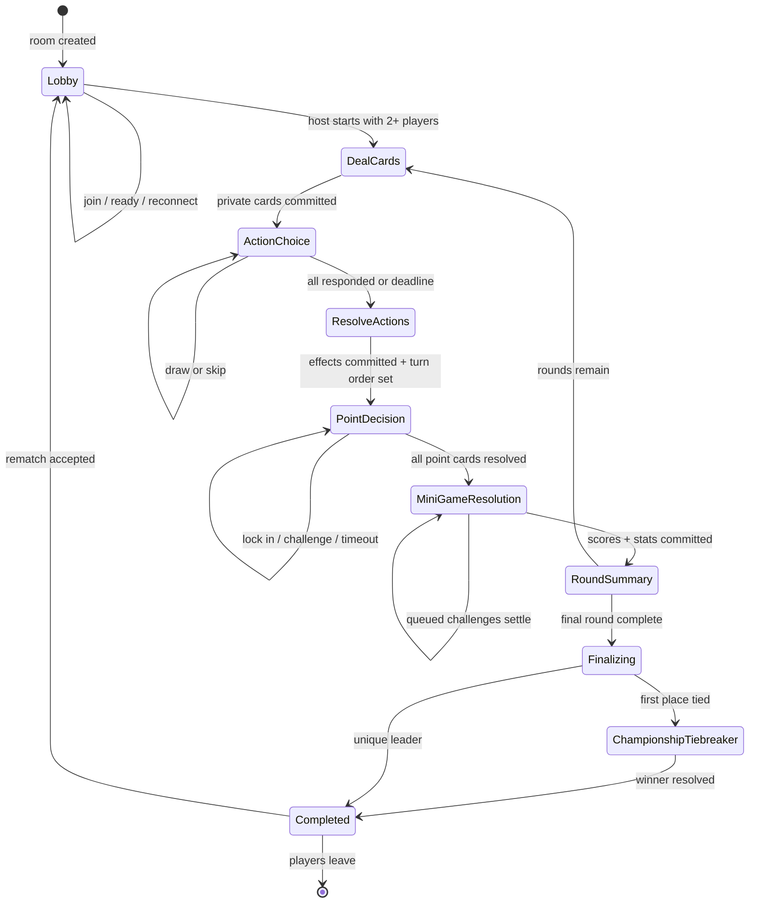

# ScoreUp engineering blueprint

## Implementation plan

ScoreUp will be delivered as seven independently verifiable milestones. Each milestone must pass its relevant automated tests and production build before work begins on the next one.

1. **Frontend foundation** — establish the React/TypeScript/Vite/Tailwind shell, routes, visual language, accessible forms, rules, and a representative lobby using typed mock data.
2. **Multiplayer foundation** — add Supabase anonymous auth, normalized Postgres migrations, RLS, room RPCs, lobby presence, ready state, host controls, and secure password verification.
3. **Core game** — implement the server-authoritative phase machine, private point-card dealing, shuffled turn order, lock-in/challenge resolution, timers, summaries, and authoritative reconnection snapshots.
4. **Action cards** — introduce the weighted, data-driven deck and transactional server resolution for every card, with deterministic rule tests and public-safe events.
5. **Mini-games** — add token/stake locking, challenge queues, seeded game specifications, three interactive games, validated result submission, tie resolution, and pot settlement.
6. **Completion and polish** — implement ranking/tiebreakers, match statistics, rematches, sharing, sound/reduced-motion preferences, accessibility passes, and resilient error/disconnection states.
7. **Deployment** — run the complete test suite, configure Cloudflare Pages and SPA fallbacks, deploy Supabase migrations/functions, document monitoring and origins, and produce portfolio-ready documentation.

## Repository structure

```text
ScoreUp/
├── app/                         # Vite/Vinext route surface for Milestone 1
│   ├── components/              # Shared navigation, controls, and game UI
│   ├── create/                  # Create-game route
│   ├── join/                    # Join-game route
│   ├── lobby/                   # Typed mock lobby route
│   ├── rules/                   # How-to-play route
│   ├── globals.css              # Tailwind entry and design tokens
│   ├── layout.tsx               # Global metadata and layout
│   └── page.tsx                 # Landing route
├── src/                         # Framework-independent application modules
│   ├── game/                    # Pure domain rules and state transitions
│   ├── minigames/               # Seeded clients and result encoders
│   ├── lib/                     # Supabase client, validation, utilities
│   ├── types/                   # Shared contracts
│   └── test/                    # Test setup and fixtures
├── supabase/
│   ├── functions/               # Authenticated server operations
│   └── migrations/              # Postgres schema, RLS, and RPCs
├── e2e/                         # Playwright multiplayer journeys
├── docs/                        # Architecture and security decisions
├── public/                      # Static assets
├── .env.example                 # Placeholder-only public environment keys
└── README.md
```

Milestone 1 uses the `app/` route surface generated for Cloudflare-compatible Vite deployment. Game rules and shared contracts move into `src/` as they are introduced so they remain presentation-independent.

## Server-authoritative game-state diagram



Every transition is a database transaction invoked by a validated Edge Function/RPC. Clients render server timestamps locally and refetch an authoritative snapshot after reconnecting; Realtime notifications are hints that state changed, never the state of record.

## Milestone acceptance gates

| Milestone | Required gate before continuing                                          |
| --------- | ------------------------------------------------------------------------ |
| 1         | Strict typecheck, component tests, responsive route build                |
| 2         | Room/auth/RLS integration tests and unauthorized-access checks           |
| 3         | Deterministic state-machine tests plus 2–10 client Playwright flow       |
| 4         | Every card effect, allowance, idempotency, and non-negative score tests  |
| 5         | Stake concurrency, duplicate submission, validation, and timeout tests   |
| 6         | Ranking, first-place tie, rematch reset, a11y, reconnect journeys        |
| 7         | Full CI suite, production build, deployed smoke test, security checklist |

## Critical questions and resolved rule conflicts

These are safe defaults for implementation; they should be confirmed before their relevant milestone.

1. **Mini-game timing:** “any round” conflicts with a fixed mini-game phase. Default: a player can queue a challenge from the point-decision phase until that round’s decision phase closes; queued challenges resolve after point cards and before the summary.
2. **Stake score snapshot:** point-card awards may change scores before mini-games resolve. Default: calculate and lock stakes atomically when the queued challenge actually starts, not when it is requested.
3. **Turn timer choices:** no allowed values are specified. Milestone 1 offers 20, 30, 45, and 60 seconds; the server will enforce the selected value from an allowlist.
4. **Permanent host disconnect:** “permanently” has no duration. Default: show disconnected immediately, retain the player for 60 seconds, and transfer host after that grace window to the earliest active player.
5. **Action phase deadline:** default to one shared server deadline. Players who do not answer are treated as Skip; targeted cards that require a choice receive a short, server-timed target step and otherwise choose a valid target securely.
6. **Tied first/last place card effects:** default to choosing uniformly and securely among tied eligible players. The drawer is excluded where the rule calls for another player.
7. **Mini-game anti-cheat:** local elapsed time cannot be perfectly trusted. The server will validate seed-derived answers, start/receipt windows, payload shape, feasible timing bounds, one submission per player, and replay keys. This deters abuse but cannot provide tournament-grade device attestation.
8. **Private-room passwords:** store only a slow password hash and per-room salt; never store or broadcast plaintext. Joining still requires an authenticated anonymous Supabase session.
9. **Rematch consent:** default to return the same roster to a ready-check lobby. The host starts only after all currently connected players mark ready; disconnected players can be removed after the grace window.
10. **Final tiebreaker:** it determines rank only and transfers no points. Tied players receive identical seeded conditions, with the documented Stop the Bar/random fallback.
